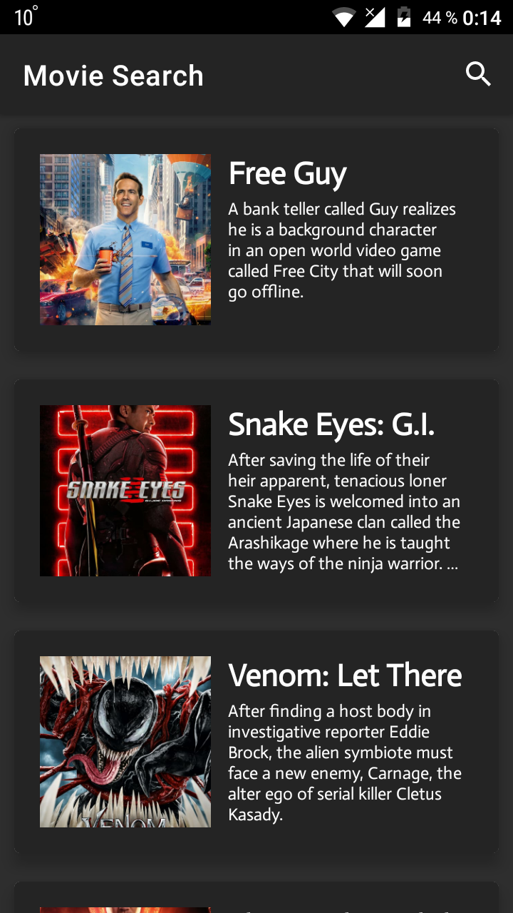
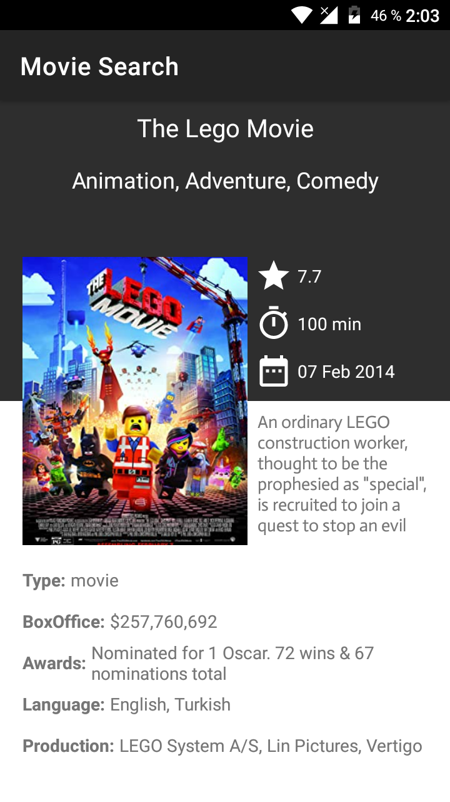
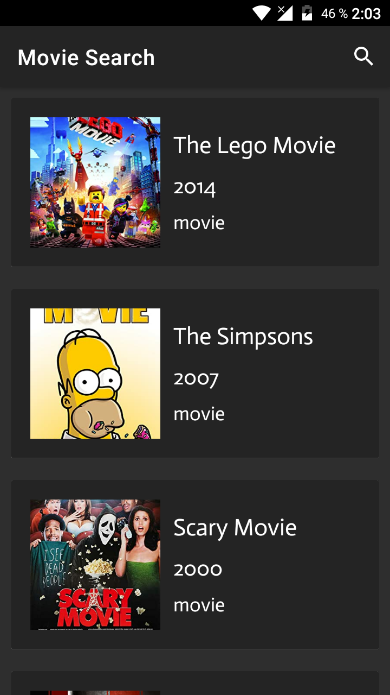

____

# Movie Search

> Этот проект является частью моего обучения на Kotlin для разработки приложений для Android.

____

## Скриншоты:

    

____

### Техническое составляющее проекта:

- Kotlin
- MVVM
- Navigation Component
- RxJava 2
- RxAndroid 2

____

> Если у вас есть вопросы по проекту, свяжитесь со мной - [Telegram](https://t.me/zurbaevi). 

___
